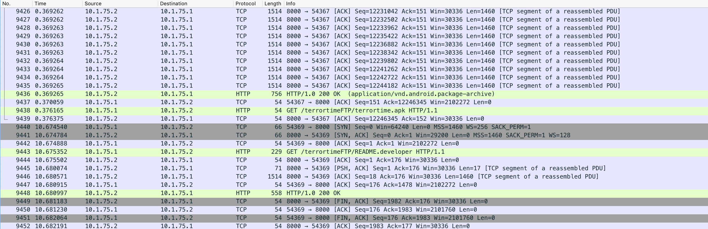
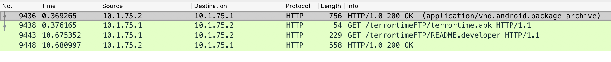
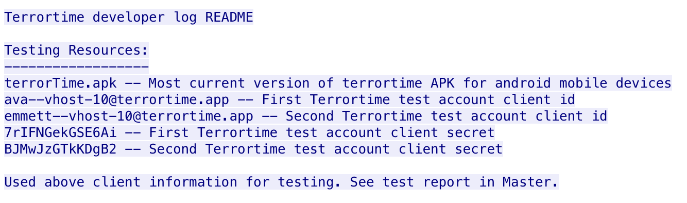

# Task 1 - It Begins!

## Prompt

There are many challenges that we will need to overcome in order to exploit TerrorTime. The first is that we do not yet have a copy of it. We have learned few details through intelligence sources, but the terrorists have managed to keep the app hidden. It is not publicly available on any App Store. Fortunately, as part of a recent military operation, specialized collection gear was forward deployed near the terrorist's area of operations. This resulted in a trove of collected traffic and we need your help to analyze it. Your first task is to find and extract a copy of the TerrorTime Android Package (APK) file from the packet capture. Submit the APK's SHA256 hash. This will help us search other intelligence sources for connections to users. To test out the app, we also need the registration information their leadership uses to register each client. Analyze the packet capture for this data and submit the registration information for 2 clients (in any order).

## Provided Files

* `terrortime.pcapng`

## Solution

### APK Extraction

The first thing we need to do is find the APK in the provided PCAP. Let's start by opening up `terrortime.pcapng` in Wireshark.



There are a ton of packets in this capture, and it looks like most of them are TCP. We can narrow it down to just HTTP by typing `http` in the filter bar. 



That's much better. Notice that the first HTTP packet is response to some request. Clicking on that packet will show the content that was sent from the server to the client. Underneath the Media Type section, we can see that `application/vnd.android.package-archive (12246122 bytes)` was served. 

That certainly sounds like an APK so now let's extract it by right-clicking on the Media Type and choosing to export the packet bytes. You can unzip the file we just got to see the contents of the APK, but we just need the hash for this task. 

```
$ openssl dgst -sha256 terror_time.apk
SHA256(terror_time.apk)= 65f87dfb701694d5b72963e6b707fda6882de72612af59296c255bef00a3699e
```

### Finding Credentials

Great! Now we have the APK and hash, but now we need creds. Lucky for us, there appears to be another request served in this PCAP. Packet 9443, a GET request for `README.developer` off of the TerrorTime FTP server, might give us a clue of where to go next.

Right-clicking on that packet and following the TCP stream gives us this lovely output:



Those credentials are what we need! It has begun. 

```
ava--vhost-10@terrortime.app:7rIFNGekGSE6Ai 
emmett--vhost-10@terrortime.app:BJMwJzGTkKDgB2 
```
