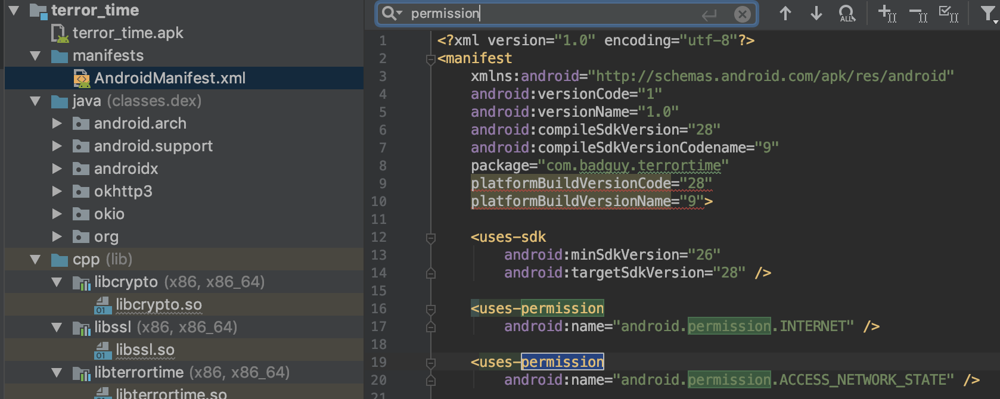

# Task 2 - Permissions

## Prompt

The TerrorTime APK file contains metadata that describes various security properties of the application that we want to know. Since we now have a copy of the APK thanks to the military operation described in Task 1, we need you to identify and submit the following:

1. App Permissions
2. The SHA256 hash of the Code Signing Certificate
3. The Common Name of the Certificate Signer

## Provided Files

* `terrortime.pcapng`

## Solution

### App Permissions

This challenge is a good time to get Android Studio up and running so the app can be emulated. I followed [this](https://codebreaker.ltsnet.net/files/downloads/resource_files/androidEmulator.pdf) guide to getting everything working.

Once the APK is imported into Android Studio we can start looking for permissions. The `AndroidManifest.xml` file contains a lot of the metadata so it's a good place to start. Searching for permissions reveals the following:



```
INTERNET
ACCESS_NETWORK_STATE
```

Are the permissions necessary for this task.

### Certificate Hash

### Signer CN
