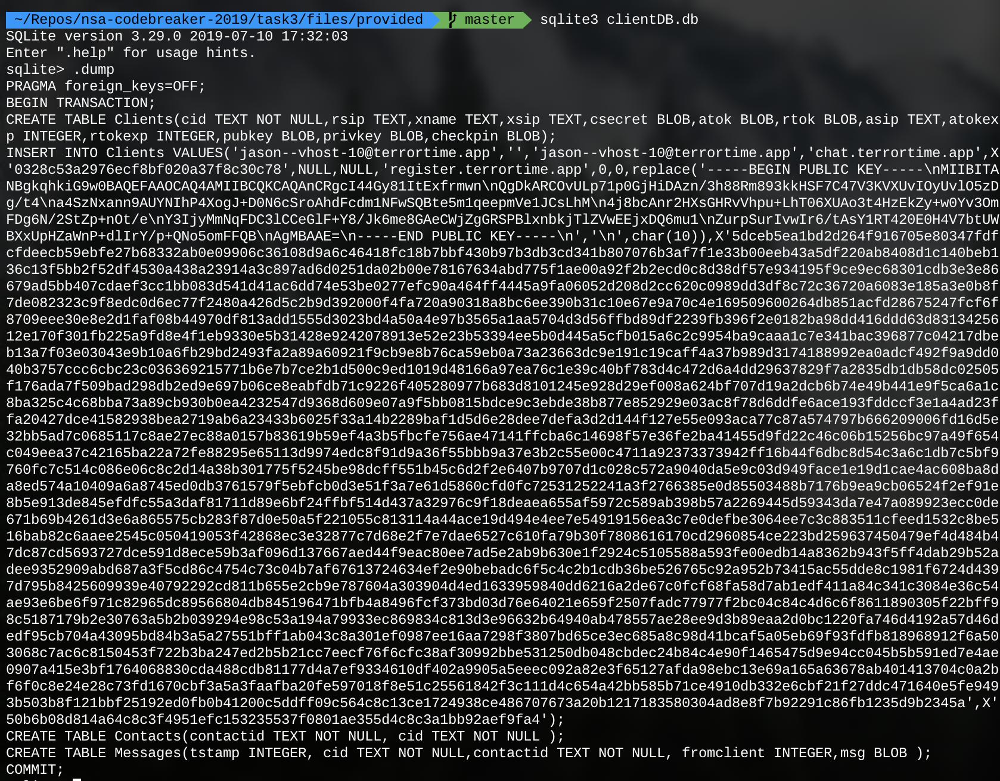

# Task 3 - Turn of Events

## Prompt

Analysts found TerrorTime installed on a device that was taken from a terrorist arrested at a port of entry in the US. They were able to recover the SQLite database from the TerrorTime installation on the device, which should provide us with more in-depth knowledge about the terrorist's communications and the TerrorTime infrastructure. Your goal for this task is to analyze the database and submit the addresses of the TerrorTime OAUTH (authentication) and XMPP (chat) servers.

## Provided Files

* `clientDB.db`

## Solution

### Database Analysis

`sqlite3` is a program we can use to interact with the database. Hopefully there isn't much stuff inside of the DB file and we can just dump the whole thing with the `.dump` command:



That's not much at all! It looks like there are two hosts, `chat.terrortime.app` and `register.terrortime.app`. `nslookup` can be used to get the IP addresses for these domains. 

```
$ nslookup chat.terrortime.app
Non-authoritative answer:
Name:	chat.terrortime.app
Address: 54.91.5.130

$ nslookup register.terrortime.app
Non-authoritative answer:
register.terrortime.app	canonical name = codebreaker.ltsnet.net.
Name:	codebreaker.ltsnet.net
Address: 54.197.185.236
```

Just a wild guess, the XMPP chat server is probably `chat.terrortime.app` and the auth server is `register.terrortime.app`.
