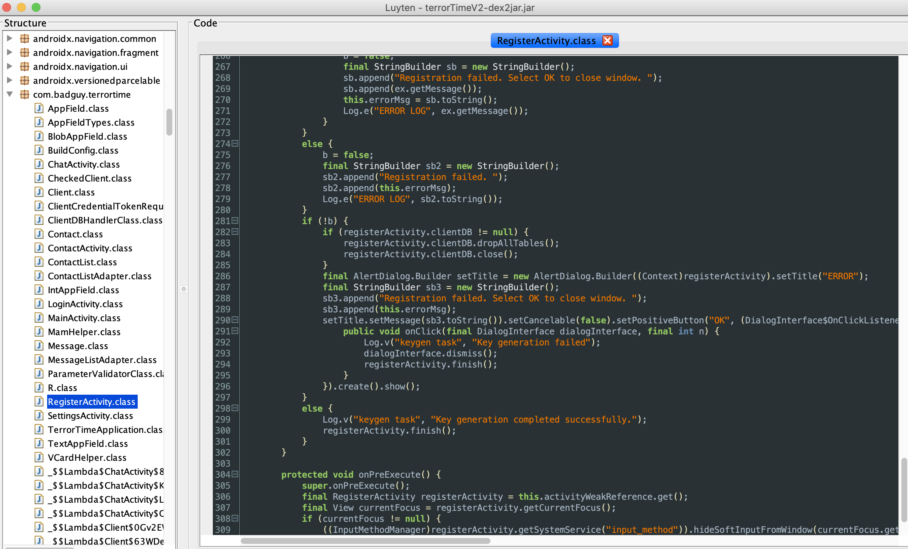
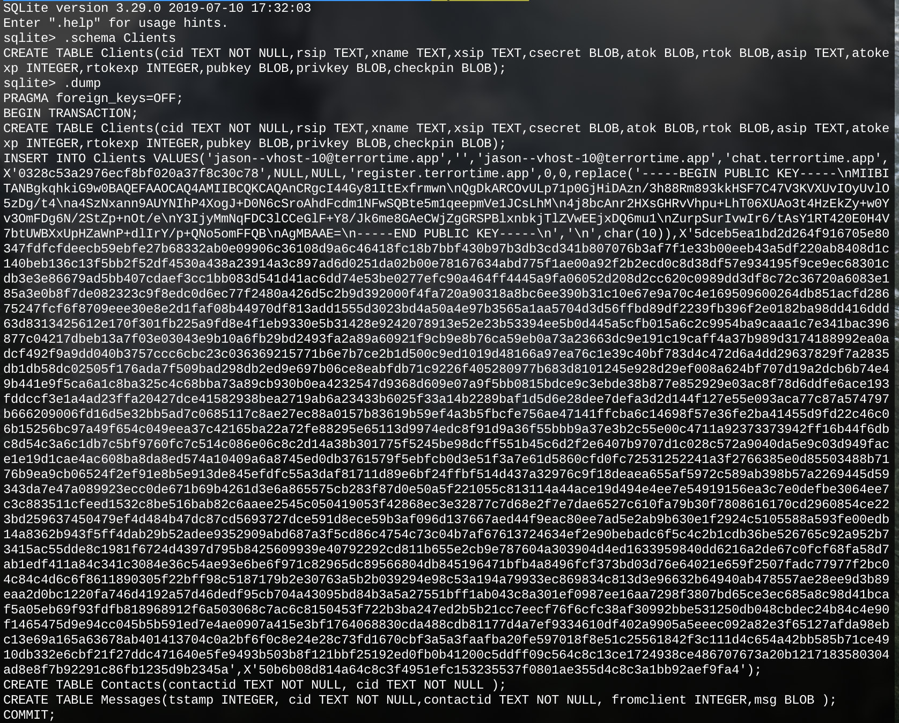
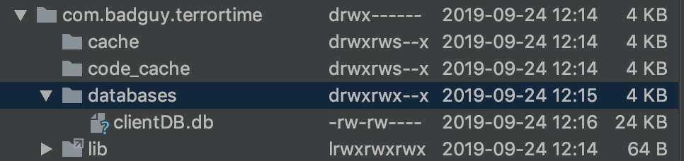
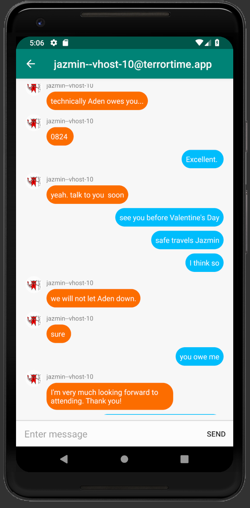
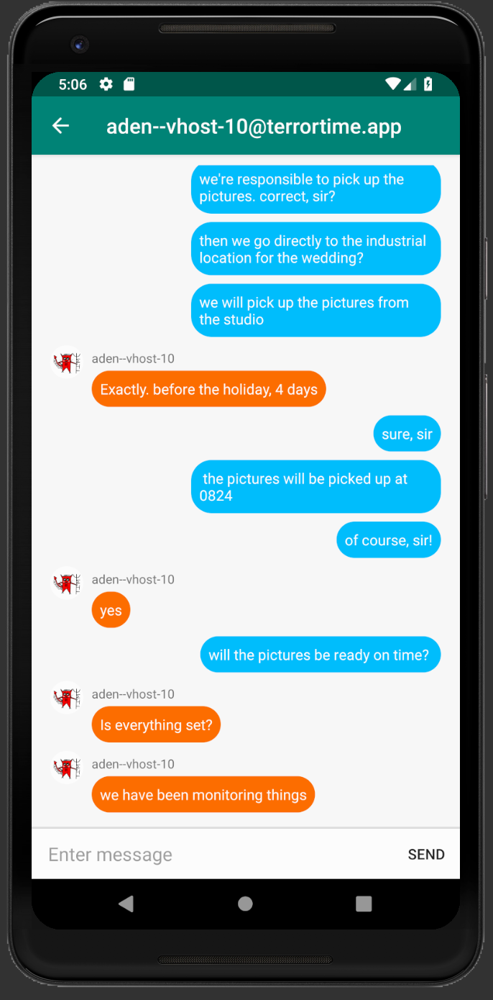

# Task 4 - Schemes

## Prompt

While analyzing the TerrorTime SQLite database found on the terrorist’s device, analysts discovered that the database has cached credentials but requires a pin to log in. If we can determine how the credentials are protected and find a way to recover the pin, we should be able to masquerade as the arrested terrorist. Perform reverse engineering to identify how the terrorist’s credentials are protected and submit the terrorist's Client ID and Client Secret. Once you have uncovered their credentials, masquerade (i.e., login) as him using the TerrorTime app. Review their chat history and assess additional information regarding their organization. Though the app encrypts messages back and forth, the terrorists have previously spoken in some form of code to ensure their plans were protected. To prove completion of this task, you will need to analyze the terrorist's conversation history in order to uncover/deduce the following information:

1. Terror Cell Leader's Username
3. The date on which the action will occur

## Solution

### Decompile APK

To get an idea of how this whole app works, we can try to decompile the Java packaged with the app. First, we'll convert the apk to a jar file with a program called `dex2jar`:

```
d2j-dex2jar terrorTimeV2.apk
```

Now we have a jar and can try using popular decompilers to get back the source code. `jd-gui` is one of the most popular decompilers but I encountered errors when trying to use it. Another populare decompiler is [Luyten](https://github.com/deathmarine/Luyten). The jar file we just created can be imported into Luyten and results in a great decompilation!



Now let's save this to a .zip, unzip it, then get rid of everything except the `com.badguy.terrrotime` stuff, the stuff we care about. 

### Cracking the PIN

Now, let's figure out exactly what happens when a user is registered to figure out where the PIN ends up and what operations it undergoes. `RegisterActivity.java` sounds like a good place to start. At the very top appears a `mPinField` variable! Let's follow it all the way to the database. The most promising line in this class is line 179:

```
this.mClient.setEncryptPin(registerActivity.mPinField.getText().toString());
```

`mClient` is an instance of `Client.class`, so we should switch over to that file and find the `setEncryptPin` method. Navigating to that method reveals that it's just a setter for `encryptPin`, no weird operations yet. Maybe `encryptPin` gets used somewhere else in the Client class? It does! in the `generateSymmetricKey` method! It appears that a 256-bit AES key is generated from the SHA-256 hash of the PIN, and another value called `checkPin` is set to this hash. 

If this hash is what's entered into the database we can iterate over every hash of a 6 digit code until it matches the hash in the database! Let's find out if the `checkPin` is what gets put in the DB. Line 263 of `RegisterActivity.class` calls `addOrUpdateClient()` which is in `ClientDBHandler.class`. And sure enough, that method enters the `checkPin` into the database!

Now we can extract the SHA-256 hash from the `clientDB.db` file and attempt to crack it. Using the `.schema` and `.dump` commands in `sqlite3` we can determine which value is the checkpin and then plug it into a hash cracker. 



`50b6b08d814a64c8c3f4951efc153235537f0801ae355d4c8c3a1bb92aef9fa4` is the hash for my particular DB file. I wrote up a quick Python script to iterate over every 6 digit code, hash it, and compare it with our goal hash. 

```
$ python3 hash_cracker.py
587148
``` 

The PIN is cracked! Now the DB file can be imported into Android Studio and we can access the messages.

### Message Analysis

The APK should already be loaded into Android Studio, so all we need to do is upload the `jason--vhost-10@terrortime.app` DB file and we should be able to log in using the Client ID and PIN. 



We can now masquerade as Jason! There are two contacts, Jazmin and Aden. The full transcript of the conversation can be found in `files/transcript.txt`.

Jazmin                      | Aden
:--------------------------:|:-----------------------:
| 

Okay, let's start with the Cell Leader's username. Jazmin at one point says _we will not let Aden down_, indicating that the Client ID for the Terror Cell Leader is:

```
aden--vhost-10@terrortime.app
```

The Action Date is next. Both messages mention a time of `0824`. That sounds like 8:24AM to me. Also, in the Aden screenshot you can see that Aden says _Exactly. before the holiday, 4 days_ and Jason says to Jazmin in the other conversation _see you before Valentine's Day_. This is a good indicator that the action will take place on 08:24 on February 10, 2020. Converting this time to a Unix timestamp gives us the following integer:

```
1581323040
```
