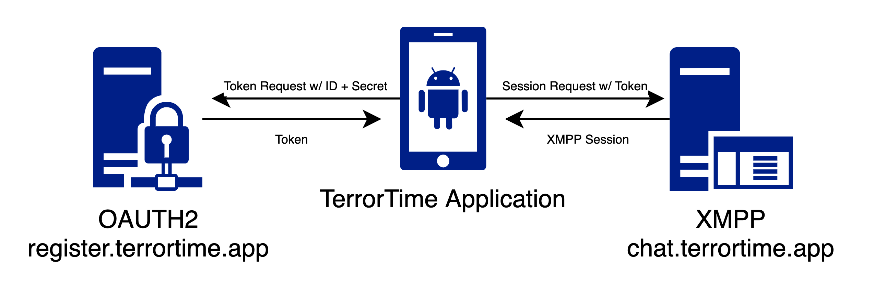
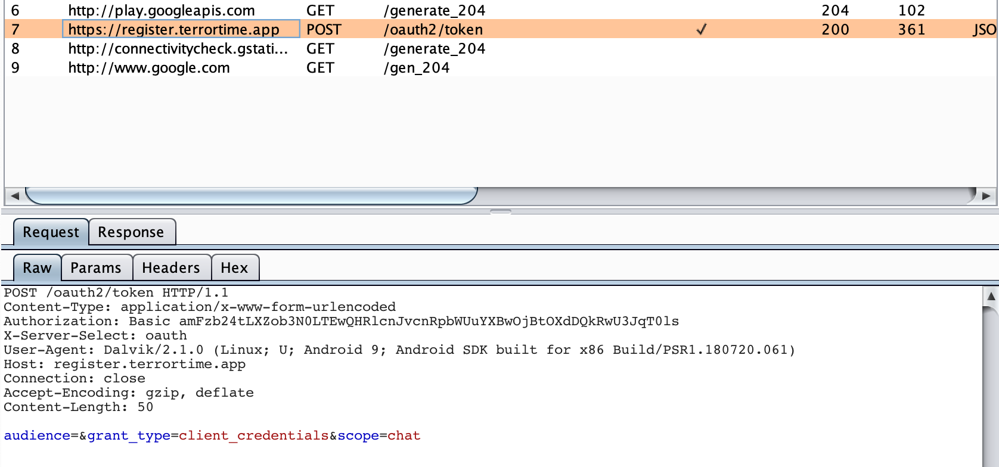
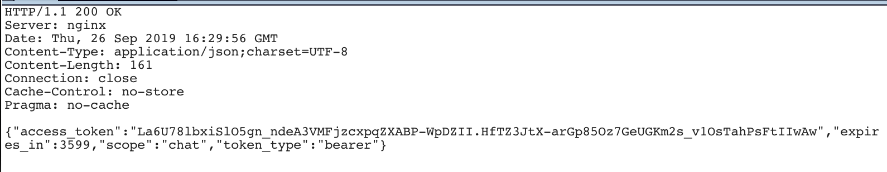
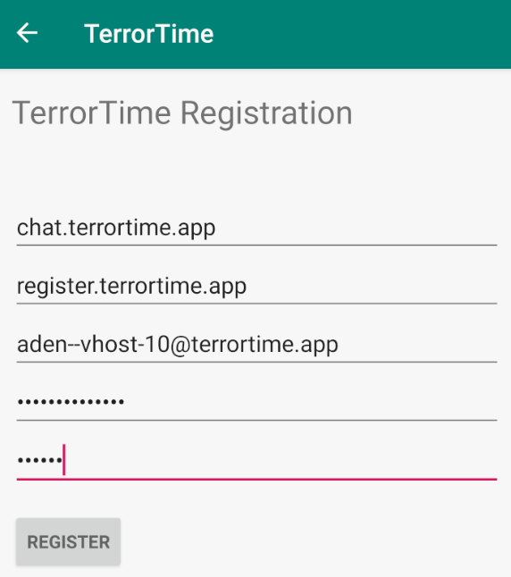
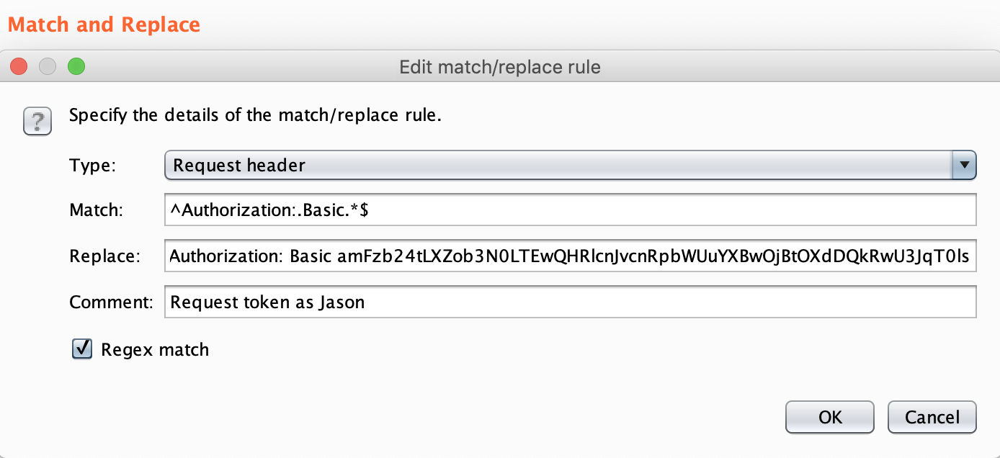
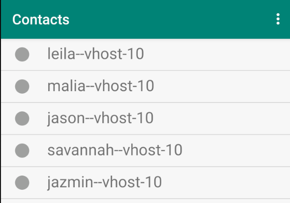
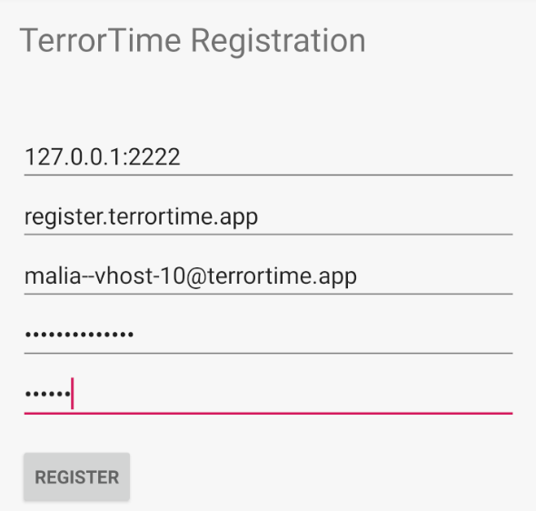
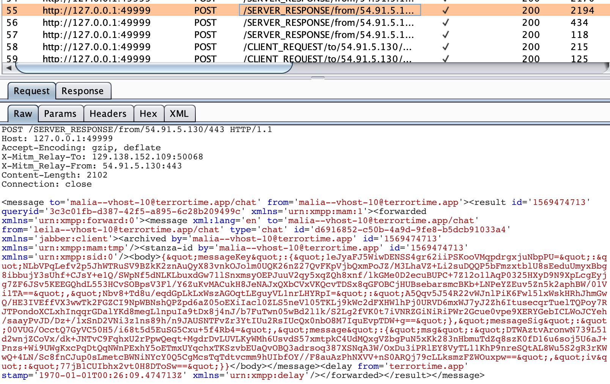

# Task 5 - Masquerade

## Prompt

The app uses a bespoke application of the OAUTH protocol to authorize and authenticate TerrorTime users to the chat service. Our intelligence indicates that individual terrorists are provided phones with TerrorTime installed and pre-registered to them. They simply need to enter their username and secret PIN to access the chat service, which uses OAUTH behind the scenes to generate a unique token that is used for authentication. This is a non-standard way of using the protocol, but they believe it to be superior to normal password-based authentication since a unique token is used per login vs. a static password. Whether that is indeed the case is up to you to analyze and assess for possible vulnerabilities. Our forensics team recovered a deleted file from the terrorist's hard drive that may aid in your analysis.

Through other intelligence means, we know that the arrested terrorist is a member of one of many cells in a larger organization. He has shown no signs of someone who is acting in a leadership role -- he simply carries out orders given to him from his cell leader, who is likely relaying information from the top-level organizational leader. To uncover information from the cell leader’s conversations, we need access to their account. The messages are end-to-end encrypted, so without the leader's private key we won't be able to decrypt his messages, but we may be able to learn more about the members of the cell and the organization's structure. Analyze the client and server-side components of the authentication process and find a way to masquerade as arbitrary users without knowing their credentials. Take advantage of this vulnerability and masquerade as the cell leader. Access and review the cell leader’s relevant information stored on the server. Use this information to identify and submit the top-level organizational leader’s username and go a step first and submit a copy of the last (still encrypted) message in the organization leader’s chat history. It’s suggested to complete task 4 before attempting this task as task 4 aids in discovering the cell leader’s identity.

## Provided Files

* `auth_verify.pyc`

## Solution

### OAUTH Exploitation

To be able to exploit the token exchange, we need to have a good understanding of how OAUTH2 works in this application. Whenever a user logs in, the Client Secret and ID is sent to the authentication server which returns a token if the credentials are valid. The token is then used to create an XMPP session with the chat server. 



Proxying the login process through a tool like BurpSuite can be used to prove this and see how the token request is formatted. I told my emulator to proxy through `127.0.0.1:8080`, the default Burp listening port, and logged in as my Jason user. 



Using this request, we can figure out how the credentials are being passed through. The authorization type is Basic, a simple base64 encoding of credentials. Let's reverse the encoding and see what's there.

```
$ echo -n "amFzb24tLXZob3N0LTEwQHRlcnJvcnRpbWUuYXBwOjBtOXdDQkRwU3JqT0ls" | base64 -D
jason--vhost-10@terrortime.app:0m9wCBDpSrjOIl
```

Great! We could make our own token requests if we wanted and experiment with different combinations of usernames and secrets and might find an exploit, but let's keep following the token for now. What does the reponse look like?



It's pretty much just the token and expiration date. Not too interesting. So now that token should be sent with the XMPP session request to the chat server in order to authenticate a user. Let's take a look at that `auth_verify,pyc` file to figure out how the XMPP server handles authentication.

`.pyc` files are compiled Python, so we should probably decompile it if we can using a tool like [uncompyle](https://pypi.org/project/uncompyle6/). `uncompyle6 auth_verify.pyc` reveals the authentication code. It takes in a token and an authenication server to verify that the token is correct. See anything weird here? Wouldn't a verification tool need to know the user it's verifying?? Apparently not. 

That's a serious flaw in the authentication system. We can use ANY user's token to authenticate as ANY OTHER USER we want! Now, that doesn't solve the problem of knowing the keys to be able to encrypt/decrypt messages but it's a great step in the right direction. It's time to test it out.

First, we have to register a user with the Client ID of the user we want to masquerade as (in this case `aden--vhost-10@terrortime.app`). Then we need to use the Client Secret for any user we have access to (`jason--vhost-10@terrortime.app`).



If we tried to log in right now, the app would send a token request with the credentials `aden--vhost-10@terrortime.app:0m9wCBDpSrjOIl`. Aden's ID with Jason's secret. This will fail, so how do we get it to succeed? The magic of BurpSuite. Burp can search a request for a certain expression and replace it automatically with whatever we want using the Match and Replace functionality. We want to replace the `Authorization` header with the correct base64 encoded credentials of Jason: `amFzb24tLXZob3N0LTEwQHRlcnJvcnRpbWUuYXBwOjBtOXdDQkRwU3JqT0ls`. 



Now we can test it by logging in. But first, know that Burp cannot proxy protocols like XMPP, so we will get a token but not be able to log in completely. The solution is to do one log in attempt with the proxy to save the token to the database, then turn off the proxy and log in again to connect to XMPP with the saved token. This will need to be done every hour. Then you should be able to access Aden's contacts.



Finally. Now we can take a guess as to which one is the top-level organization leader. I just tried them in order and this one ended up working:

```
malia--vhost-10@terrortime.app
```

### XMPP Intercept

The second half of this task is to intercept the last message of the top-level organization leader. We know her username now so we could perform the same exploit to get her contacts, but still no encrypted messages. The problem is that the XMPP connection does not use HTTP so we can't intercept with Burp and it does use TLS, so we can't intercept it with Wireshark.

I attempted to log in to the XMPP server with my own client, but that failed every time so I gave up. Then I started looking into ways to proxy protocols like XMPP. I found this really neat tool called [mitm-\_relay](https://github.com/jrmdev/mitm_relay) that will wrap protocols in an HTTP request, then forward it to BurpSuite. The best of both worlds! I followed the setup instructions on that page so I won't go into it here, but this is what my command ended up looking like:

```
python mitm_relay.py -r tcp:2222:chat.terrortime.app:443 -p localhost:8080 -c server.pem -k server.key
```
* `-r tcp:2222:chat.terrortime.app:443` forwards all incoming traffic on port 2222 to `chat.terrortime.app:443` after being proxied.
* `-p localhost:8080` tells the relay to proxy all of the traffic through BurpSuite so we can see it there.
*
This is great, but unfortunately the Android Emulator wouldn't proxy the XMPP traffic through `localhost:2222`. Luckily the developers were nice enough to let us input our own chat server! So we can set the chat server to `127.0.0.1:2222`, then the relay will handle the proxy and communication with the real chat server! 



Now we do the double login thing and make sure Burp and mitm_relay are running. If it was set up correctly, Burp should have all of the encrypted messages!



I'm pretty sure that's the last message. Codebreaker wants it in JSON, which might make you think you need to convert the XML to JSON, but what they actually want is the body of the message. It's already in JSON, but is URL encoded. Highlight the body, send it to the Decoder, and Smart Decode to get it into the right format.

```
{"messageKey":{"1eJyaFJ5WiwDENSS4gr62iiPSKooVMqpdrgxjuNbpPU=":"NLbVPqLefv2p5JhWTRuSV9BZkK2znAuQyX83vnkOJolm0UQK26nZ27QvFKpVjbQxmPoJZ/M3LhaVZ+Li2suDQQP5bFmzxtblU8sEeduUmyxBbg8ibbujY3sUhf+CJsY+e1Q/SWpNf5dNLKLbuxdGw71lSnxmsyOEPJuuV2qy5xqZQh8xnf/lkGMe0D2ecuBUPC+7Z12o1lAqP0325HXyD9N9XpLcgEyjg7ZF6JSv5KEEGQhdL553HCvSOBpsV3Fl/Y6ZuKvMACukH8JeNAJxQXbCVxVKQcvTDSx8qGFOBCjHUBsebarsmcBKb+LNPeYZEuv5Zn5k2aphBW/01Vi1TA==","Nbv8+Td8u/eqdGpLkLxWszAGOqtLEguyVL1nrLHYRpI=":"A5Qqv5J54R22vWJnlPiK6Fwl5lxWskHRhJhmGwQ/HE3IVEffVX3wwTk2FGZCI9NpWBNshQPZpd6aZ05oEXiIacl0ZLS5neVl05TKLj9kWc2dFXHWlhPj0URVD6mxWJ7yJ2Zh6ItusecqrTuelTQPoy7RJTPondoXCLxhInqqrGDalYKd8megLlnpuIa9tDx8j4nJ/b7FuTwn05wBd2l1k/S2Lg2fVK0t7iVNRZGiNiRiPWr2Gcue0vpe9XERYGebICLWoJCYeh/saayPvJD/Dz+/1xSnD2VNi3z1ns89h/n9JAUSNTFvZr3YtIUu2RsIUcQx0nbO8M7IquEvpTDW+g=="},"messageSig":"00VUG/OcctQ7GyVC50H5/i68t5d5EuSG5Cxu+5f4Rb4=","message":{"msg":"DTWAztvAronwN739L51d2wnjZCoVx/dk+JNTvC9FqhxU2rPpwQeqt+MgdrDvLUVLKyWMh6UsvdS57xmtpkC4UdMQxgVZbgPuN5xKk283nHbmuTdZq8szK0fD16u6soj5U6aJ+Pnzs+Wi9UWgKxcPqDtQqNWnPExhY5oETmxUYqchxTKSzvbEUaQvOBQ3adrsoq387XSNqA3W/OxDu3iPRlEY8VyTL11KhP9nreSQtAL8Wu5S2gR3rKWwQ+4LN/Sc8fnCJup0sLmetcBWNiNYcY0Q5CgMcsTqTdtvcmm9hUIbfOY//F8auAzPhNXVV+nS0ARQj79cLLksmzFZWOuxpw==","iv":"77jB1CUIbhx2vt0H8DToSw=="}}
```
